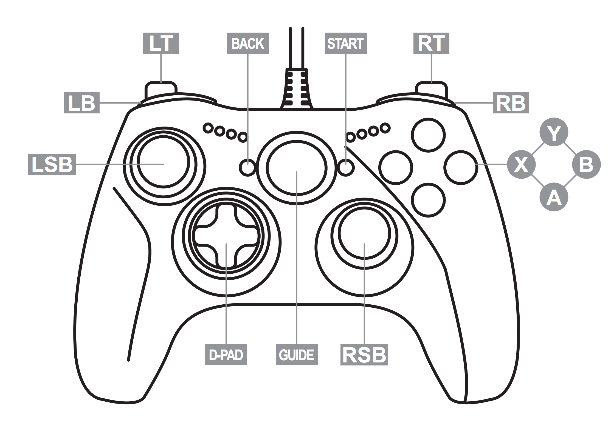

# python-joystick-demo
Simple example of Python Joystick

This script initializes and runs an event loop to handle joystick events using the pyjoystick.sdl2 library.
It defines functions to print messages when a joystick is attached or detached, and to handle key events from the joystick.
The key_received function processes various joystick inputs such as buttons, hats (D-pad), and axes, and prints corresponding messages.
Functions:
- print_add(joy): Prints a message when a joystick is attached.
- print_remove(joy): Prints a message when a joystick is detached.
- key_received(key): Handles key events from the joystick and prints corresponding messages based on the key type and value.
The script runs the event loop with the defined functions to handle joystick events.




Example output while buttons are pressed and released:
```
Attatched  <-- attached already before running the script
Detatched Xbox 360 Controller  <-- disconnect the controller
Attatched Xbox 360 Controller  <-- re-connect it again
A pressed
A released
B pressed
B released
X pressed
X released
Y pressed
Y released
DPAD UP
DPAD released
DPAD UP
DPAD UP-RIGHT
DPAD UP
DPAD released
DPAD RIGHT
DPAD released
DPAD RIGHT
DPAD released
DPAD DOWN-RIGHT
DPAD RIGHT
DPAD released
DPAD DOWN
DPAD released
DPAD DOWN
DPAD DOWN-LEFT
DPAD LEFT
DPAD released
DPAD LEFT
DPAD released
DPAD LEFT
DPAD UP-LEFT
DPAD LEFT
DPAD released
LB pressed
LB released
RB pressed
RB released
BACK pressed
BACK released
START pressed
START released
GUIDE pressed
GUIDE released
LT value: 0.0
LT value: 0.18823529411764706
LT value: 0.3411764705882353
LT value: 0.5372549019607843
LT value: 0.6823529411764706
LT value: 0.8980392156862745
LT value: 1.0
LT value: 0.9450980392156862
LT value: 0.7529411764705882
LT value: 0.4980392156862745
LT value: 0.25098039215686274
LT value: 0.01568627450980392
LT value: 0.0
RT value: 0.0
RT value: 0.12549019607843137
RT value: 0.30980392156862746
RT value: 0.6666666666666666
RT value: 0.9803921568627451
RT value: 1.0
RT value: 0.9098039215686274
RT value: 0.6196078431372549
RT value: 0.24313725490196078
RT value: 0.0
LSY value: -1.5259021896696368e-05
LSY value: -0.06251621271076524
LSY value: -0.14064240482185097
LSY value: -0.15626764324406806
LSY value: -0.1093919279774167
LSY value: -1.5259021896696368e-05
LSY value: -0.03126573586633097
LSX value: 1.5259021896696368e-05
LSX value: -0.015609979400320384
LSY value: -1.5259021896696368e-05
LSX value: -0.2187380788891432
LSX value: -0.4531166552224002
LSX value: 1.5259021896696368e-05
RSY value: -1.5259021896696368e-05
RSY value: -0.023453116655222428
RSY value: -0.3281452658884566
RSY value: -0.3828336003662165
RSY value: -0.29689478904402233
RSY value: -0.10157930876630805
RSY value: -1.5259021896696368e-05
RSX value: 1.5259021896696368e-05
RSX value: -0.1093614099336232
RSX value: -0.21092545967803467
RSX value: -0.29686427100022883
RSX value: -0.33592736705577175
RSX value: 0.8828412298771648
RSX value: 1.0
RSX value: 0.8672159914549478
RSX value: 0.5312733653772794
RSX value: 1.5259021896696368e-05
LSY value: -0.015640497444113888
LSY value: -1.5259021896696368e-05
```
