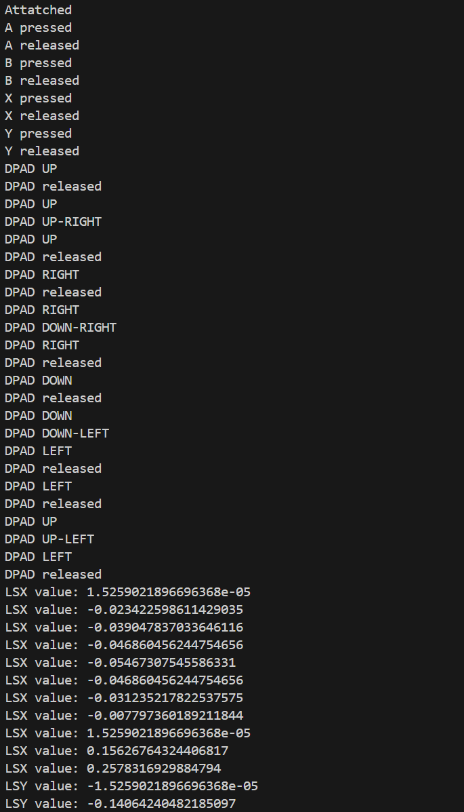

# python-joystick-demo
Simple example of Python Joystick

This script initializes and runs an event loop to handle joystick events using the pyjoystick.sdl2 library.
It defines functions to print messages when a joystick is attached or detached, and to handle key events from the joystick.
The key_received function processes various joystick inputs such as buttons, hats (D-pad), and axes, and prints corresponding messages.
Functions:
- print_add(joy): Prints a message when a joystick is attached.
- print_remove(joy): Prints a message when a joystick is detached.
- key_received(key): Handles key events from the joystick and prints corresponding messages based on the key type and value.
The script runs the event loop with the defined functions to handle joystick events.

